# About us

## Neuroinformatics Unit{.smaller}

::: {.columns}
::: {.column width="40%"}
- Sainsbury Wellcome Centre & Gatsby Computational Neuroscience Unit, UCL (London)
:::
::: {.column width="60%"}

:::
:::

## Neuroinformatics Unit{.smaller}

::: {.columns}
::: {.column width="40%"}
- Sainsbury Wellcome Centre & Gatsby Computational Neuroscience Unit, UCL (London)

:::{.fragment}
- (Systems) neuroscience & machine learning **research software engineering** group
:::
:::{.fragment}
- Build sustainable, general-purpose software infrastructure for the neuroscience community

:::

:::
::: {.column width="60"}

:::
:::


## Neuroinformatics Unit

(Systems) neuroscience & machine learning **research software engineering** group

Build sustainable, general-purpose software infrastructure for the neuroscience community


## What we do
:::{.incremental}
- **Data analysis software** (anatomy, electrophysiology, functional imaging, behaviour)
- **Data management** (specifications, tools)
- **Collaborations** (data science, software development, productionisation)
- **Open source contributions** (community tools, infrastructure)
:::

## Current priorities
:::{.incremental}
* Data standardisation and management
* Computational neuroanatomy
* Video behavioural analysis
* Multiphoton imaging analysis
:::


# Data management

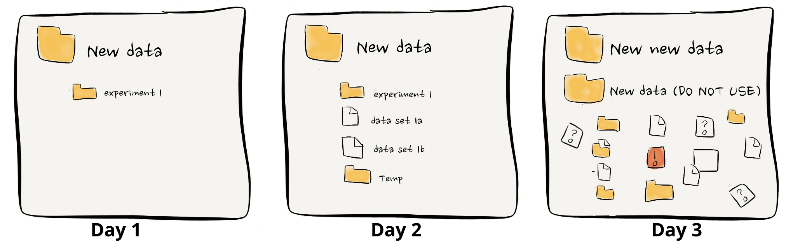

::: {.absolute right="0%" bottom="-10%" style="text-align: right; font-size: 0.5em;"}
Image source: [ErrantScience](https://errantscience.com/)
:::


## The NeuroBlueprint specification {.smaller}

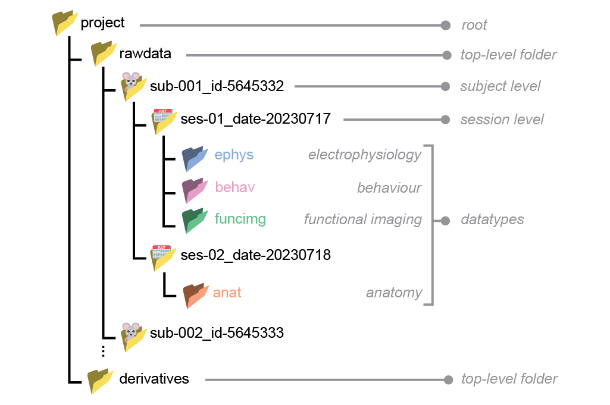


::: footer
[neuroblueprint.neuroinformatics.dev](https://neuroblueprint.neuroinformatics.dev/){fig-align="center"}
:::

## `datashuttle` {.smaller}

:::: {.columns}

::: {.column width="60%"}
{fig-align=left}
:::

::: {.column width="40%"}

::: {.fragment}
- Validate existing projects
- Create and configure new projects
- Create folders with real-time validation
- Upload and download data
- Keep logs of all actions
:::

:::
::::

::: {.absolute right="0%" bottom="0%" style="text-align: right; font-size: 0.71em;"}
[Ziminski et al. (2026) JOSS](https://doi.org/10.21105/joss.09642)
:::

::: footer
[datashuttle.neuroinformatics.dev](https://datashuttle.neuroinformatics.dev/){fig-align="center"}
:::

## Python API
```python
from datashuttle import DataShuttle

project = DataShuttle("my_first_project")
project.make_config_file(
    local_path=r"C:\Users\Joe\data\local\my_first_project",
    central_path=r"C:\Users\Joe\data\central\my_first_project",
    connection_method="local_filesystem",
)
project.create_folders(
    top_level_folder="rawdata",
    sub_names="sub-001",
    ses_names="ses-001_@DATE@",
    datatype=["behav", "ephys"]
)

project.upload_entire_project()
```
::: {.absolute right="0%" bottom="0%" style="text-align: right; font-size: 0.5em;"}
[Ziminski et al. (2026) JOSS](https://doi.org/10.21105/joss.09642)
:::


::: footer
[datashuttle.neuroinformatics.dev](https://datashuttle.neuroinformatics.dev/){fig-align="center"}
:::

## Terminal user interface

{.absolute .nostretch top="23%" width="80%" left="10%" loop="true"}


::: {.absolute right="0%" bottom="0%" style="text-align: right; font-size: 0.5em;"}
[Ziminski et al. (2026) JOSS](https://doi.org/10.21105/joss.09642)
:::

# Anatomy
## BrainGlobe {.smaller}

::: {.columns}
::: {.column width="55%"}
Three aims:

:::{.incremental}
1. Build tools for specific analysis and visualisation needs 
2. Develop infrastructure for others to build on
3. Foster a community of users and developers
:::

:::
::: {.column width="45%"}

:::
:::

::: footer
[brainglobe.info](https://brainglobe.info)
:::

## BrainGlobe Atlas API
{fig-align="center"}

::: {.absolute right="0%" bottom="0%" style="text-align: right; font-size: 0.5em;"}
[Claudi et al. (2020) JOSS](https://doi.org/10.21105/joss.02668)
:::

::: footer
[brainglobe.info/documentation/brainglobe-atlasapi](https://brainglobe.info/documentation/brainglobe-atlasapi)
:::

# Whole brain microscopy

## 
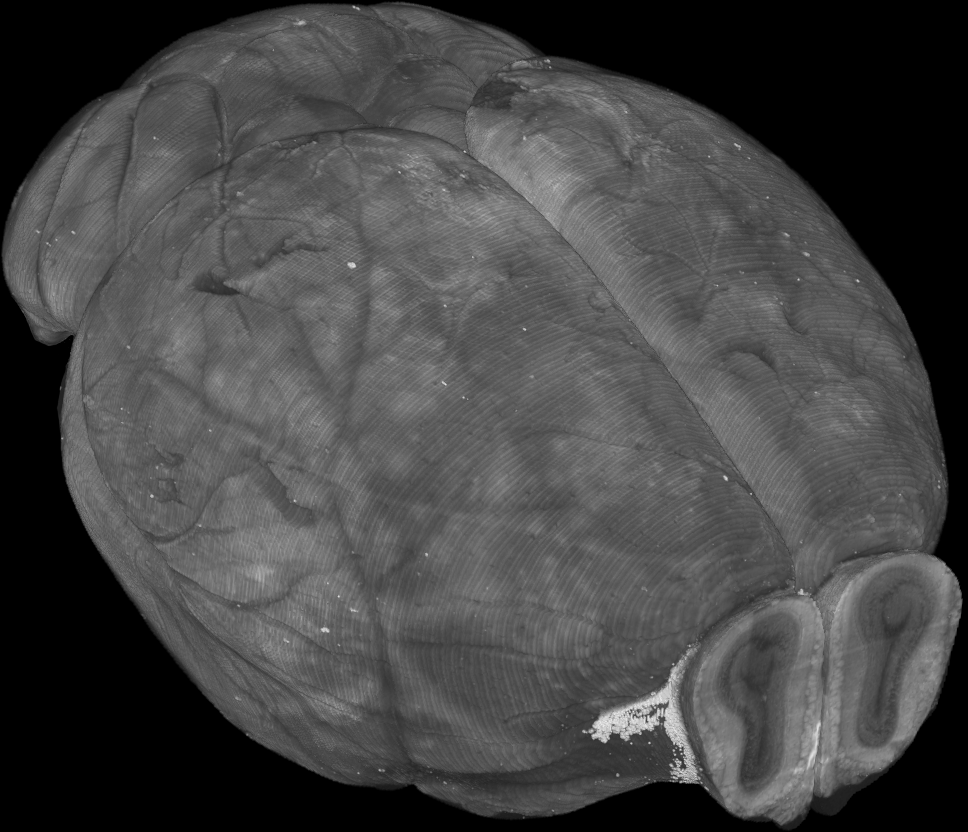{fig-align="center" width=70%}

## 
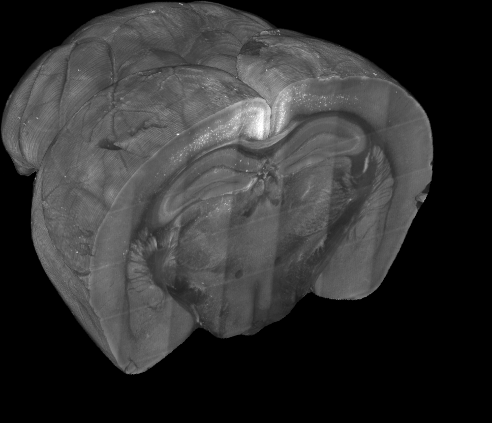{fig-align="center" width=70%}

## Whole-brain registration


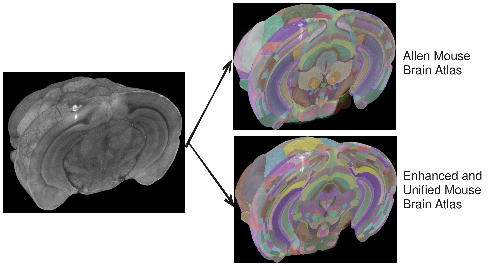{.absolute .nostretch top="20%" width="90%" left="5%"}


::: {style="background: #ffffff; width: 15%; height: 65%; margin: 0px; position: absolute; top: 23%; right: 6%"}
:::

::: {.absolute top="32%" left="79%" style="font-size: 0.7em;"}
Allen Mouse<br/>
Brain Atlas
:::

::: {.absolute top="65%" left="79%" style="font-size: 0.7em;"}
Enhanced and<br/>
Unified Mouse<br/>
Brain Atlas
:::

::: {.absolute right="0%" bottom="0%" style="text-align: right; font-size: 0.5em;"}
[Tyson et al. (2022) Sci Rep](https://doi.org/10.1038/s41598-021-04676-9)
:::

::: footer
[brainglobe.info/documentation/brainreg](https://brainglobe.info/documentation/brainreg/index.html)
:::


## Spatial analysis

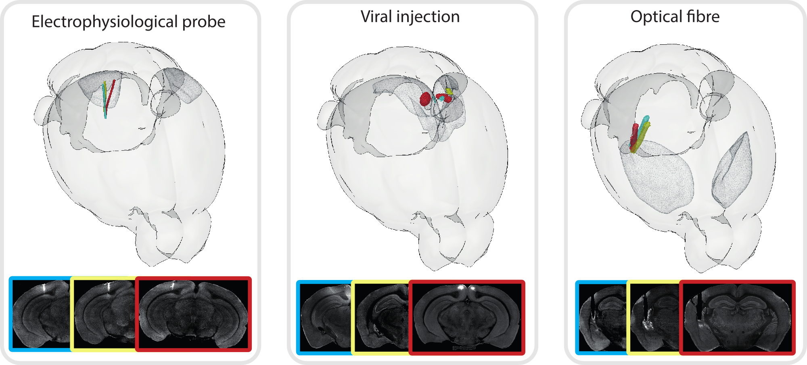{.nostretch fig-align="center" width="90%"}


::: {.absolute right="0%" bottom="0%" style="text-align: right; font-size: 0.5em;"}
[Tyson et al. (2022) Sci Rep](https://doi.org/10.1038/s41598-021-04676-9)
:::

::: footer
[brainglobe.info/documentation/brainglobe-segmentation](https://brainglobe.info/documentation/brainglobe-segmentation/index.html)
:::


## 3D cell detection

{.nostretch fig-align="center" width="70%"}


::: {.absolute right="0%" bottom="0%" style="text-align: right; font-size: 0.5em;"}
[Tyson et al. (2021) PLoS Comp Biol](https://doi.org/10.1371/journal.pcbi.1009074)
:::

::: footer
[brainglobe.info/documentation/cellfinder](https://brainglobe.info/documentation/cellfinder/index.html)
:::


## 3D cell detection

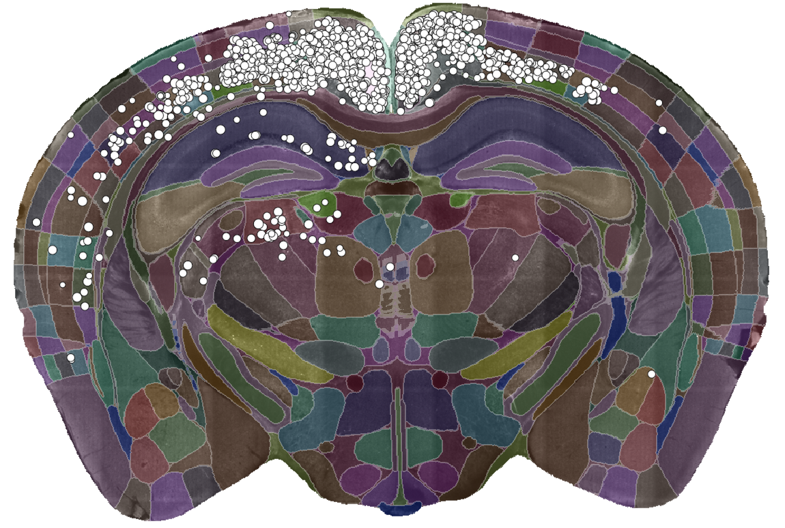{.nostretch fig-align="center" width="70%"}


::: footer
[brainglobe.info/documentation/brainglobe-workflows/brainmapper](https://brainglobe.info/documentation/brainglobe-workflows/brainmapper/index.html)
:::


::: footer
[brainglobe.info/documentation/brainglobe-workflows/brainmapper](https://brainglobe.info/documentation/brainglobe-workflows/brainmapper/index.html)
:::

## Visualisation

{.absolute .nostretch top="23%" width="70%" left="15%" loop="true"}


::: {.absolute right="0%" bottom="0%" style="text-align: right; font-size: 0.5em;"}
[Claudi et al. (2021) eLife](https://doi.org/10.7554/eLife.65751)
:::

::: footer
[brainglobe.info/documentation/brainrender](https://brainglobe.info/documentation/brainrender/index.html)
:::

## Building novel atlases
{fig-align="center"}

::: {.absolute right="0%" bottom="0%" style="text-align: right; font-size: 0.5em;"}
[Sirmpilatze et al. (2026) Current Biology](https://doi.org/10.1016/j.cub.2026.03.034)
:::

::: footer
[brainglobe.info/brainglobe-template-builder](https://brainglobe.info/brainglobe-template-builder/index.html)
:::

## Community
:::{.incremental}
* Focus on ease of use & accessibility
* Responsive user & developer forums
* Fully open development
* Public development meetings
* &gt;3M downloads
* &gt;3k contributions from >150 scientists & engineers
* &gt;80 dependent tools
:::

::: footer
[brainglobe.info](https://brainglobe.info)
:::


# Behaviour


## Computer vision for behaviour

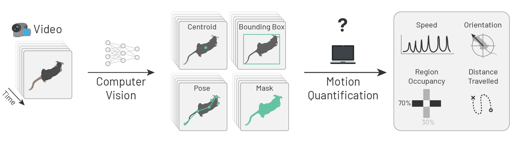{style="clip-path: inset(0 43% 0 0);"}

## Computer vision for behaviour


## `movement`

{height=450}


::: footer
[movement.neuroinformatics.dev](https://movement.neuroinformatics.dev/)
:::

## Computer vision for behaviour

{style="clip-path: inset(0 43% 0 0);"}


## PoseInterface
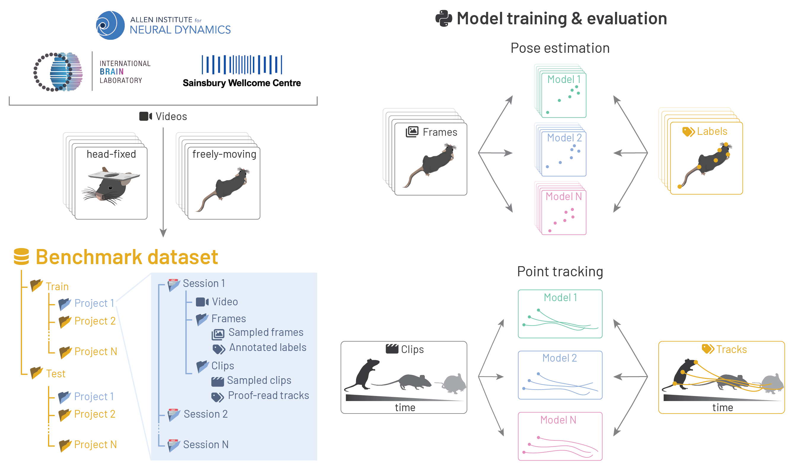{fig-align="center"style="clip-path: inset(0 58% 0 0);"}

## PoseInterface
{fig-align="center"}

::: footer
[poseinterface.neuroinformatics.dev](https://poseinterface.neuroinformatics.dev/)
:::

# Functional Imaging


## photon-mosaic
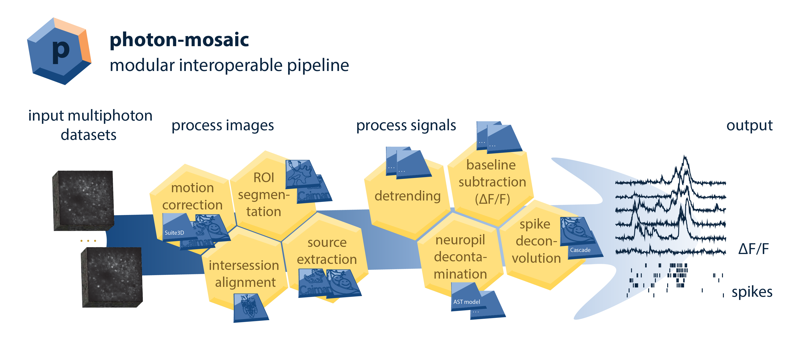{fig-align="center"}

::: footer
[github.com/photon-mosaic](https://github.com/photon-mosaic)
:::

## Long-term priorities

## Long-term priorities
### (Why I'm here)

:::{.incremental}
- Bring community together
- Reduce duplication of effort
- Ensure interopability
- Sustainability
:::

# Thanks

## Support

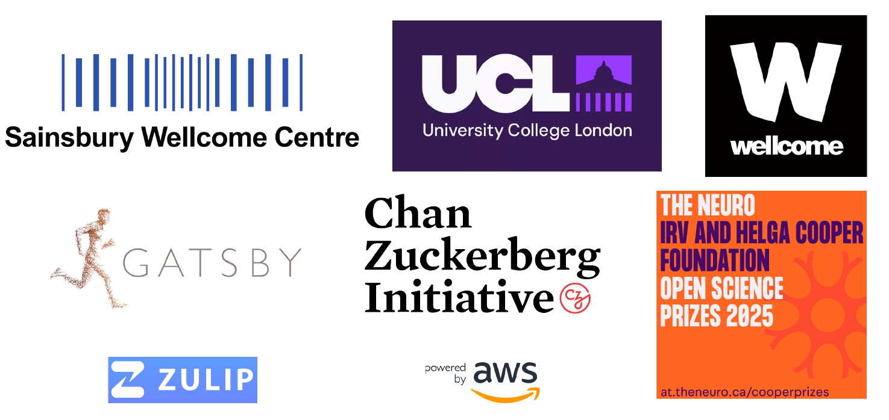{fig-align="center"}

## Team {.smaller}

::: {layout-nrow=2}


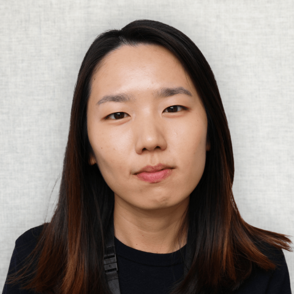


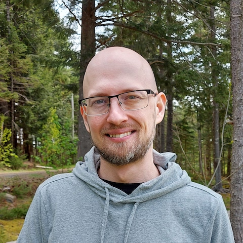


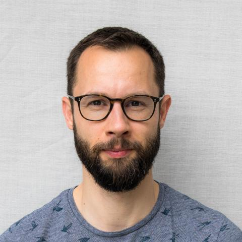


:::

## Contributors

::: {style="font-size: 45%;"}

Will Graham, Patrick Roddy, Adrien Berchet, Mathieu Bourdenx, bkntr, NovaFae, David Young, Sam Clothier, Gubra-ApS, Kailyn Fields, ramroomh, Samuel Diebolt, Chris Roat, Oren Amsalem, kclamar, Draga Doncila Pop, juanma9613, Jules Scholler, Iaroslavna Vasylieva, Nicolas Peschke, Justin Kiggins, Peter Sobolewski, Simão Bolota, chili-chiu, jaimergp, Sebastian Lammers, Matt Colligan, Paul Brodersen, Carter Peene, francesshei, Sean Martin, Ben Dichter, 4iar, Marco Musy, Anna Medyukhina, stegiopast, EmanPaoli, lidakanari, Alexis Arnaudon, Ziyang Liu, Philip Shamash, Christian Niedworok, Charly Rousseau, Horst Obenhaus, Chryssanthi Tsitoura, Sepiedeh Keshavarzi, Mateo Vélez-Fort, Stephen Lenzi, Rob Campbell, Alessandro Felder, Federico Claudi, Luigi Petrucco, Adam Tyson, Troy Margrie, Tiago Branco, Ruben Portugues, Joe Ziminski, Sofia Miñano, Niko Sirmpilatze, Nicholas Del Grosso, Laura Porta, Lee Cossell, Antonin Blot, David Pérez-Suárez, David Stansby,  koushik-ms, Harald Reingruber, Emily Jane Dennis, Peak, Maximilian Blacher, Hernando Martinez Vergara, Estelle, nicole-vissers, GD, Michael Kunst, Estelle Nassar, Sara Mederos, Igor Tatarnikov, Viktor Plattner, Carlo Castoldi, Jingjie Li, Guillaume Le Goc, Harry Carey, Matt Einhorn, Kimberly Meechan, Robert Kozol, Roberto, Axel Bisi, Jung Woo Kim, Saima Abdus, Saarah Hussain, Sacha Hadaway-Andreae, Presa, Henry Crosswell, Nischit Kumar, Kirato Yoshihara, Leonard Schwigon, Dinora Abdulazhanova, Katrin Haase, Dominik Heyers, Isabelle Museliak, Henrik Mouritsen, Simon Weiler, Stella Prins, Richard Dushime, Miguel Xochicale, M S P, Abdul Samad, Prisha Sharma, Farida Yusuf, Anshu Saini, Menna1812, ayush2281, BethCr, Swapnaneel Patra, Xiaoyu Deng, DwarvesEatRocks, DPWebster, Conrad, pranav33317, Biswanath Saha, Federico F, Tim Monko, Kaixiang Shuai, Giulia Paci, Marco Dalla Vecchia, Pavel Vychyk, Ishrat Zaman, Fatma S. Elsharkawy, Chang Huan Lo, Pascal Malkemper, Alireza Saeedi, Nasibeh Amini, Aref hossein Akhlaghi, Li Zhang, Leoni-Marie Webb, Nishanth B, Ardavan Shahrabi, Varun Singh, Harshdip Saha, sid-42-d, James Rowland, Kavyashah067, Aditya Gupta, Luigi Meola, Ajitesh Kumar Singh, Chandrika, Hargun Kaur, Rahul Bera, Hashbrownsss, Divyansh Gupta, Yaroslav Halchenko, Bhanushali Parth Hitesh, Harsh Bhanushali, Tushar Verma, maxstaras, Akseli Ilmanen, Lakshmi Sowmya, Sparshr04, Shigraf Salik, Vedant Vakharia, ishan372or, Holly Morley, Parth Chatupale, Shreecharana N, Eric Denovellis,  Iván Varela, Vaco Schiavo, Laura Schwarz, Mohamed Reda, Mikkel Roald-Arbøl, Sanjana Soni, vybhav72954, Kasra Shirvanian, Kunal Dadlani, Dhruv Yadav, angkul07, Eduardo Augusto, CeliaLrt, Animesh Sasan, Tushar Das, Dhruv Sharma, Ishaan Shaikh, Brandon Peri, Shrey Singh, Damacharla Sushma, Sumana Sree Angajala,  Shreejan Dolai, Aryan Srivastava, Alexandro Berumen, Alessio Buccino, Arielle Leon, Sergio Valbuena, Matthew Scroggs, kawaho4, Andrew Moffitt, Ankush Agarwal
:::

